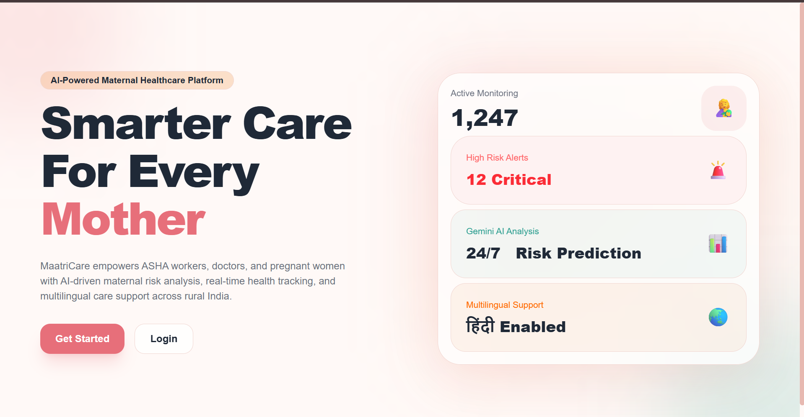
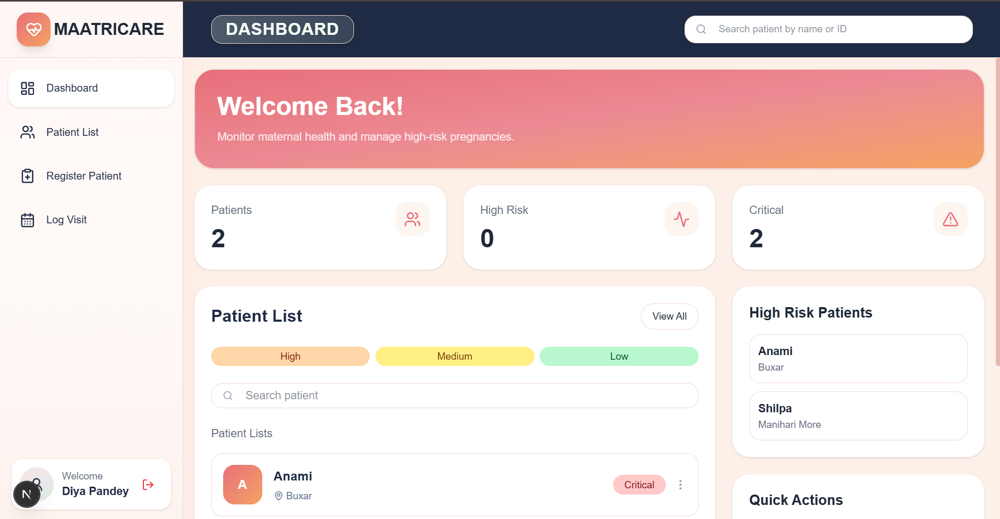
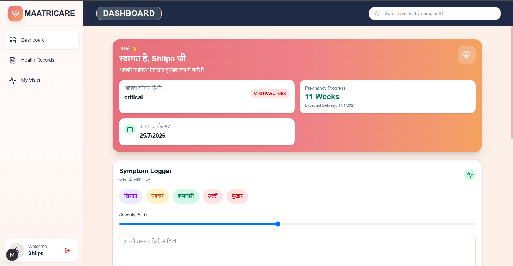
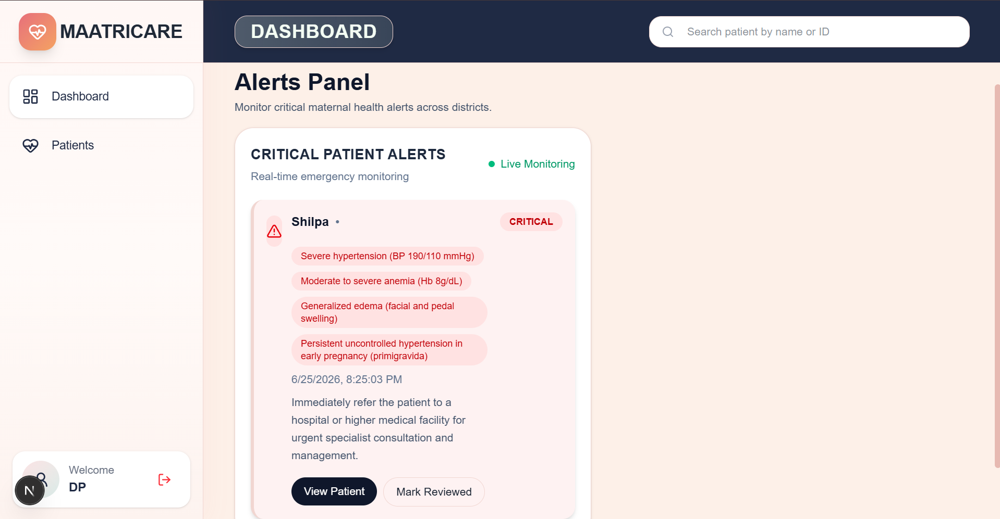

# 🌸 MaatriCare

> AI-Powered Maternal Health Monitoring Platform for Rural India

MaatriCare is a full-stack healthcare platform designed to improve maternal healthcare accessibility in rural India. The system enables ASHA workers to record patient visits, uses Google Gemini AI to identify high-risk pregnancies, alerts doctors in real time, and allows pregnant women to monitor their health in Hindi.

---
### Landing Page



---

## 🚀 Project Highlights

-👩‍⚕️ Three-role healthcare workflow (ASHA, Patient, Doctor)
- 🤖 AI-powered pregnancy risk assessment using Gemini
- ⚡ Real-time alerts using Socket.io
- 🌐 Hindi-friendly patient experience
- 🔐 Secure Role-Based Access Control (RBAC)

---

## 🏗️ System Roles

### 👩‍⚕️ ASHA Worker

- Register pregnant women
- Record home visits
- Log symptoms and observations
- View assigned patients
- Receive AI-generated risk alerts
- Schedule next appointments

  


---

### 🤰 Patient (Mother)

- View personal health records
- Log daily symptoms in Hindi
- Track pregnancy progress
- Upload lab reports
- View upcoming appointments
- Access emergency contact support
- Receive personalized health advice



---

### 🩺 PHC Doctor

- View only high-risk patients
- Receive instant emergency alerts
- Add clinical notes
- Approve or reject ASHA reports
- Monitor district-wide risk patterns



---

## 🧠 AI Risk Detection

Google Gemini analyzes patient data and identifies potential high-risk pregnancies.

### Risk Factors Considered

- Blood Pressure
- Weight Changes
- Age
- Pregnancy Stage
- Reported Symptoms
- Previous Medical History

### Example Risk Analysis

```json
{
  "riskLevel": "HIGH",
  "confidence": "92%",
  "reason": [
    "Elevated Blood Pressure",
    "Severe Swelling",
    "Rapid Weight Gain"
  ]
}
```

Doctors receive prioritized alerts, allowing quicker intervention for critical cases.

---

## ⚡ Real-Time Alert Pipeline

```text
ASHA Worker Logs Visit
          ↓
Patient Data Stored
          ↓
Gemini Risk Analysis
          ↓
High Risk Detected
          ↓
Socket.io Alert Triggered
          ↓
Doctor Dashboard Updated
```

---

## 🏛️ System Architecture

```text
                     ┌─────────────────┐
                     │   Gemini AI     │
                     └────────┬────────┘
                              │
                              ▼

┌─────────────┐     ┌─────────────────┐     ┌─────────────┐
│ ASHA Worker │────▶│ Node.js Backend │────▶│  MongoDB    │
└─────────────┘     └─────────────────┘     └─────────────┘
       │                     │
       │                     ▼
       │              Socket.io Alerts
       │                     │
       ▼                     ▼

┌─────────────┐     ┌─────────────────┐
│   Patient   │     │  PHC Doctor     │
└─────────────┘     └─────────────────┘
```

---

## 🔐 Role-Based Access Control

The platform implements secure authentication and authorization using JWT.

| Role | Permissions |
|--------|------------|
| ASHA Worker | Register patients, log visits, monitor assigned mothers |
| Patient | View records, upload reports, log symptoms |
| Doctor | Review risks, add notes, approve reports |

---

## 📈 Engineering Highlights

### Multi-Role Workflow Design

Implemented three completely different user experiences while maintaining a unified backend architecture.

### AI-Powered Risk Prediction

Integrated Gemini AI for real-world clinical risk assessment instead of simple chatbot interactions.

### Real-Time Communication

Implemented Socket.io-based emergency notifications to reduce response time for critical pregnancy cases.

---

## 🎯 Impact

- Early detection of high-risk pregnancies
- Faster medical intervention
- Improved healthcare accessibility
- Reduced paperwork
- Better continuity of care
- Digital maternal health records
---

## 👨‍💻 Author

**Diya**
- GitHub: [@Diyaprg](https://github.com/Diyaprg)

---

## 📄 License

This project is for educational purposes.
